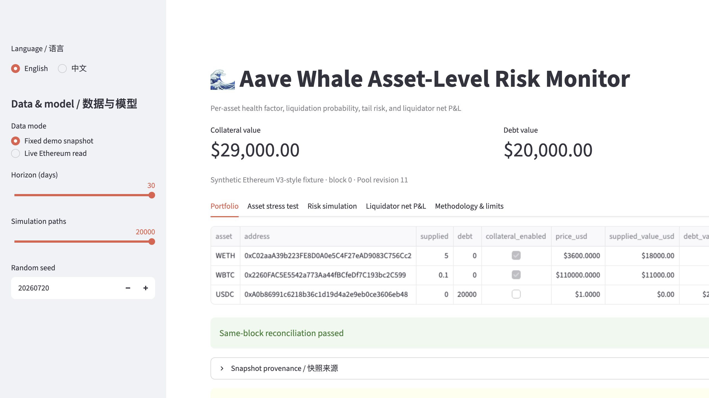
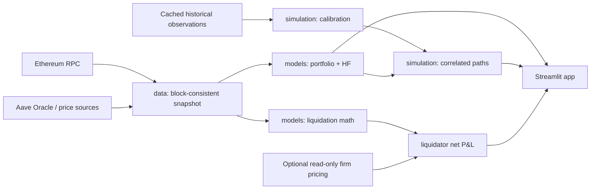

# Aave Whale Risk Monitor

[](https://github.com/JasperChan-24/aave-risk-radar/actions/workflows/ci.yml)
[](https://github.com/JasperChan-24/aave-risk-radar/actions/workflows/evidence-gate.yml)
[](https://www.python.org/downloads/release/python-3120/)
[](LICENSE)

[Live Streamlit app](https://jasper-aave-radar.streamlit.app/) ·
[Fixed analysis artifact](reports/fixed_snapshot_analysis.json) ·
[Empirical validation](reports/empirical_validation.json) ·
[Liquidation replay](reports/liquidation_replay.md) ·
[Validation evidence](reports/validation_report.md) ·
[Research report](reports/research_report.md)



Asset-level liquidation-risk research for Aave V3 on Ethereum.

The dashboard reconstructs a borrower's position reserve by reserve, calibrates a correlated
multi-asset price model from fixed historical observations, estimates first-passage liquidation
risk and tail loss, and evaluates liquidator economics after protocol fees, flash-loan premium,
gas, and read-only firm-pricing inputs. It is designed as a reproducible research portfolio
project, not a liquidation bot.

> 中文概述：项目按用户真实的逐资产抵押与负债重算健康因子，并输出 1/7/30 天清算概率、
> 首次触线时间、VaR/ES、置信区间，以及逐项列示主要成本的清算人净收益。

## Why the prototype was rebuilt

| Prototype | Current design |
| --- | --- |
| Scaled aggregate health factor by one unnamed shock | Revalues every collateral and debt asset with its own oracle price and effective threshold |
| Used fixed `u=1.1`, `d=0.95`, `p=1/3` | Uses an explicit 30-day horizon, daily step, historical volatility, and cross-asset covariance |
| Drew 100 unseeded paths | Runs deterministic, chunked Monte Carlo and computes liquidation probability, TTL, VaR/ES, and confidence intervals |
| Reported `50% debt × 5%` as “risk-free profit” | Applies revision-aware Aave amount rules and itemizes bonus, protocol fee, flash fee, gas, quoted proceeds, and net P&L |
| Mixed RPC, math, and UI in one file | Separates `data`, `models`, `simulation`, and `app`, with offline fixtures and unit tests |

## Architecture



The only fixed protocol bootstrap is Ethereum's Aave V3 `PoolAddressesProvider`. The active
Pool, Price Oracle, and Data Provider are discovered at runtime, and every call in a snapshot
uses the same block tag. The app uses the canonical Aave oracle price because that is what the
protocol consumes; the underlying source address is retained for Chainlink/SVR/adapter
provenance.

## Risk outputs

- Per-asset supplied balance, debt balance, collateral flag, price, LTV, liquidation threshold,
  liquidation bonus, protocol fee, and position value.
- Reconstructed health factor with a same-block comparison to `getUserAccountData`.
- User-specified, independent asset shocks for deterministic scenario analysis. This is not a
  substitute for the separately checked-in convergence, rolling VaR backtest, stablecoin-jump,
  and covariance-matched heavy-tail evidence.
- 1-, 7-, and 30-day liquidation probability with a 95% Wilson interval for simulated future
  events; an initially liquidatable snapshot instead has the deterministic interval `[1,1]`.
  First passage remains strict below `HF=1`, with a disclosed eight-ULP guard against binary
  summation noise exactly at the boundary.
- First observed time-to-liquidation distribution with non-hitting paths treated as censored.
- 95% and 99% VaR/Expected Shortfall on fixed-quantity, terminal mark-to-market borrower
  net-equity loss, with bootstrap confidence intervals. Paths are not transitioned into a
  post-liquidation portfolio after first passage.
- Pair-specific liquidator P&L with close factor, collateral capacity, dust constraints,
  protocol fee, current Pool flash premium, gas, optional execution/MEV cost, and fixed or
  optional read-only firm pricing. The route guard checks actual and virtual reserve liquidity,
  aToken supply for the flash principal, same-asset callback ordering, self-liquidation, quote
  block lag, and whether the manual gas budget covers 0x's reported network fee.

The deployed Pool revision is recorded in every snapshot. The implementation targets Aave V3
revision 11/v3.7 and fails closed for unsupported semantics. Its liquidation adapter validates
the economically relevant **unscaled** debt-repayment and collateral-seizure amount arithmetic
used by the P&L model. It is not a byte-for-byte `liquidationCall` emulator: the snapshot and
model do not reproduce scaled aToken balance settlement, liquidity-index/Ray rounding, or the
fee-cap end state. Those mechanics can matter at raw-unit boundaries. One observed WETH/USDT
revision-11 liquidation is replayed exactly against both its historical `LiquidationCall` and a
block-minus-one mainnet fork; broader reserve-pair and branch coverage remains future work. Aave's
[view contracts](https://aave.com/docs/aave-v3/smart-contracts/view-contracts),
[oracle interface](https://aave.com/docs/aave-v3/smart-contracts/oracles), and
[v3.7 liquidation changes](https://github.com/aave-dao/aave-v3-origin/blob/main/docs/3.7/Aave-v3.7-changelog.md)
are the primary protocol references.

## Run locally

Python 3.12 is recommended.

```bash
python3.12 -m venv .venv
source .venv/bin/activate
python -m pip install -e ".[dev]"
cp .env.example .env
streamlit run app.py
```

To install the exact package versions used by the local macOS/Python 3.12 validation run:

```bash
python -m pip install -r requirements-lock.txt
python -m pip install -e . --no-deps
```

`ALCHEMY_RPC_URL` (or `ETHEREUM_RPC_URL`) enables live portfolio reads. Archive access is
needed only when rebuilding historical Aave-oracle caches. The offline demo and checked-in
fixtures keep the UI and tests usable without network access.

`ZEROX_API_KEY` is optional. When present, the P&L layer can request a timestamped 0x
AllowanceHolder **firm pricing** quote in read-only mode. The adapter validates expected and
minimum buy amounts plus supported fee fields and
discards transaction calldata; it does not claim that the quoted trade is executable at a later
block. Without it, the optional 0x mode fails explicitly and the separately selected,
clearly-labelled fixed/assumption mode remains available; the app never silently turns an oracle
valuation into sale proceeds.

## Reproduce and verify

```bash
python -m pip check
ruff check .
ruff format --check .
mypy src/aave_risk_monitor
pytest --cov=aave_risk_monitor --cov-report=term-missing
python scripts/verify_evidence.py
```

Unit tests are offline and deterministic. RPC integration tests are marked `integration` and
operate against a fixed block when explicitly enabled. Snapshot JSON stores chain ID, block
number/hash/timestamp, contract addresses and Pool revision, eMode, raw balances, reserve
configuration, oracle price/source, actual and virtual reserve liquidity, aToken total supply,
and Aave's aggregate account values.

Snapshot JSON intentionally contains only block-pinned protocol and provenance data. Simulation
configuration and random seed are attached to each in-memory simulation result and displayed by
the app; they are not embedded in the snapshot artifact. See the
[validation evidence](reports/validation_report.md) for the boundary between implemented checks
and the research roadmap.

The repository includes a real read-only [Ethereum snapshot](snapshots/README.md) at block
`25,573,974`. To capture a new fixed block:

```bash
python scripts/capture_snapshot.py --user 0xYOUR_BORROWER --block latest --output snapshots
```

The checked-in fixed-block snapshot has a matching 366-observation Aave-oracle cache at
[`data/history/ethereum-v3-whale-block-25573974.csv`](data/history/ethereum-v3-whale-block-25573974.csv).
To rebuild a trailing 365-return window from an archive RPC, ask the capture utility for 366
daily observations:

```bash
python scripts/capture_history.py \
  --snapshot snapshots/1-ed0c6079229e2d407672a117c22b62064f4a4312-block-25573974.json \
  --days 366 \
  --output data/history/ethereum-v3-whale-block-25573974.csv
```

For a manually curated sample, provide one explicit archive block per consecutive UTC date.
This keeps the sampling decision reviewable:

```bash
python scripts/capture_history.py \
  --snapshot snapshots/1-USER-block-N.json \
  --blocks-file data/daily-blocks.txt \
  --output data/prices.csv
```

The CSV records the date, block number/hash, block timestamp, oracle address, and an
address-keyed price column for every active collateral or debt asset. Historical capture calls
the oracle address recorded in the snapshot at each past block; it does not rediscover the
provider's active oracle independently at every observation. The cache therefore assumes that
the provider's oracle address did not change across the requested window. A window spanning an
oracle migration must be segmented by oracle era and validated separately.

Reproduce the checked-in 20,000-path numerical result (including input hashes, calibration,
probability intervals, TTL censoring, and terminal mark-to-market VaR/ES) with:

```bash
python scripts/run_fixed_analysis.py \
  --snapshot snapshots/1-ed0c6079229e2d407672a117c22b62064f4a4312-block-25573974.json \
  --history data/history/ethereum-v3-whale-block-25573974.csv \
  --output reports/fixed_snapshot_analysis.json
```

The resulting [machine-readable analysis artifact](reports/fixed_snapshot_analysis.json) has a
zero 30-day liquidation-frequency point estimate for this high-HF account, but its Wilson 95%
upper bound is non-zero; this is not evidence that liquidation risk is literally zero.

Generate the deterministic convergence, rolling out-of-sample VaR, stablecoin-jump, and
covariance-matched Student-t evidence with:

```bash
python scripts/run_empirical_validation.py
```

The checked-in [empirical report](reports/empirical_validation.json) uses an observed high-HF
account as a control and a clearly disclosed synthetic `HF=1.05` portfolio for sensitivity.
Time-step, path-count, and calibration-window checks pass their recorded tolerances. The rolling
95% VaR backtest does **not** pass all acceptance checks: unconditional coverage passes, while
the independence test detects clustered breaches. This negative result is part of the release
evidence, not tuned away.

The [historical liquidation replay](reports/liquidation_replay.md) pins an observed account at
`HF=0.999565096476407496`, one block before Ethereum transaction
[`0xd138…ab62f`](https://etherscan.io/tx/0xd138a0455f087ad399820fb42f4fd35ca8f8986c223609afabf1cba1ffdab62f).
The model matches the event's USDT repayment and WETH delivered to the liquidator with zero
raw-unit delta. With an archive RPC and Anvil, reproduce the original signed transaction on a
block-minus-one mainnet fork with:

```bash
RUN_MAINNET_FORK=1 \
ANVIL_COMMAND="npx --yes @foundry-rs/anvil@1.7.1" \
python scripts/run_fork_validation.py
```

## Project layout

```text
src/aave_risk_monitor/
├── data/          # Aave/Oracle reads, historical observations, snapshots
├── models/        # Portfolio health, liquidation rules, liquidator P&L
├── simulation/    # Calibration, correlated paths, risk metrics
├── validation/    # Convergence, backtests, stresses, historical/fork replay
└── app/           # Streamlit presentation and orchestration
tests/             # Golden cases, statistical tests, offline fixtures
reports/           # Research methodology, validation evidence, limitations
scripts/           # Reproducible snapshot/history capture utilities
snapshots/         # Immutable public-chain snapshot artifacts
```

## Research boundaries

This project does not sign or submit transactions. Daily paths can miss intraday barrier
crossings; Gaussian dynamics can understate jumps, stablecoin depegs, and liquidity spirals;
quotes can expire; and MEV competition or state changes can make a theoretically profitable
liquidation fail. Confidence intervals describe simulation sampling uncertainty, not complete
model uncertainty. VaR/ES stop at the horizon mark-to-market state and do not model the
balance-sheet transition, execution loss, or feedback effects after liquidation. The rolling
VaR study uses today's fixed token quantities at historical prices rather than reconstructed
historical balances, and its breach-independence check fails. The heavy-tail and stablecoin
experiments are sensitivity scenarios, not fitted regime models. Systematic global sensitivity
analysis remains future work. The revision-11 P&L adapter models unscaled amounts; the one fork
replay does not establish full scaled aToken/liquidity-index/Ray or fee-cap equivalence across
all branches.
Read the full
[research report](reports/research_report.md) before interpreting results.

## License

MIT. See [LICENSE](LICENSE).
